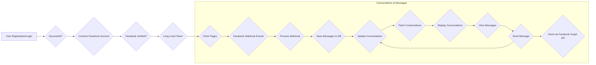

F --> K

+-------------------+

**Explanation:**

1. **User Registration/Login:** The user registers or logs in.
2. **Successful Login?:** If successful, proceed. Otherwise, the user needs to log in again.
3. **Connect Facebook:** The user connects their Facebook account.
4. **Facebook Verified?:** If Facebook verification is successful, proceed. Otherwise, the user needs to try again.
5. **Fetch Facebook Pages:** The user's Facebook pages are fetched and displayed.
6. **User Interaction:** The user interacts with the system (e.g., view messages, send messages).
7. **Facebook Webhook Events:** Facebook sends webhook events when new messages are received.
8. **Process Message:** The system processes the received message.
9. **Update Conversation:** The conversation is updated based on the processed message.
10. **Fetch Conversations:** The user can fetch their conversations.
11. **Display Conversations:** The conversations are displayed to the user.
12. **Send Message:** The user can send a message through the system.
